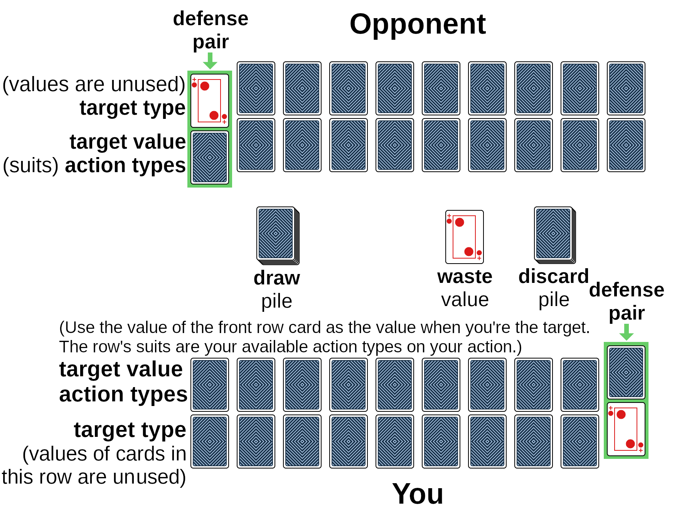

# 16 Combos
16 Combos is an *ultra-advanced* (lol) card game such as for people who find regular card games repetitive. I invented this game while watching other people play various games that use playing cards. The games were uninspiring, so the game is mostly inspired by role-playing games :). 16 Combos (16combos.com) by Poikilos (the author of [The Path of Resistance](zahyest.com)) is also a multi-player turn-based battle system using playing cards! You don't need a computer: 16 Combos has multiple dimensions of gameplay while requiring only playing cards and counters (such as coins, chips, bingo counters, or something on which to write numbers).

What makes the game interesting is that it isn’t just a game of “this number vs that number” like most card games. There can be 16 different actions depending on the combination of the attack and defense.

A printable copy of the rules is in the "documentation" folder.

On Twitter, you an use `#16Combos` and mention `@poikilos_` to spread the word.

