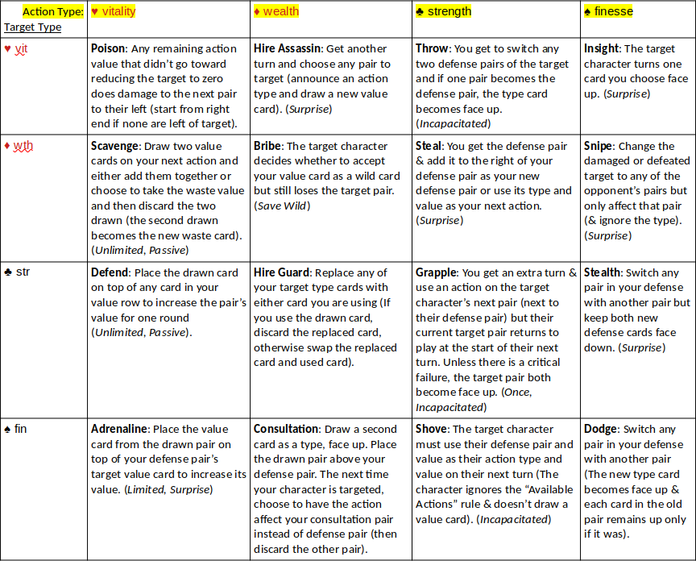

# 16 Combos
16 Combos is an *ultra-advanced* (lol) card game such as for people who find regular card games repetitive. I invented this game while watching other people play various games that use playing cards. The games were uninspiring, so the game is mostly inspired by role-playing games :). 16 Combos (16combos.com) by Poikilos (the author of [The Path of Resistance](https://zahyest.com)) is also a multi-player turn-based battle system using playing cards! You don't need a computer: 16 Combos has multiple dimensions of gameplay while requiring only playing cards and counters (such as coins, chips, bingo counters, or something on which to write numbers).

What makes the game interesting is that it isn’t just a game of “this number vs that number” like most card games. There can be 16 different actions depending on the combination of the attack and defense.

- `*` <ins>Override</ins>: Unless a combo affects that.
- `**` <ins>Second Turn</ins>: You can’t use a two-turn action if you get a second action (if the defense changes due to another rule or combo, you have to change the type or lose the second turn if you have no attack type that doesn’t have a two-turn action)
- `***` Use Maximum Value rule
- `****` Ignore Maximum Value rule  **** Use Wild Card rule
- `*****` <ins>Surprise</ins>: Regardless of other rules or combos, the target can’t make changes to their target pair in any way after the action value is revealed (but they can do so before).

A printable copy of the rules is in the "documentation" folder.

On Twitter, you an use [#16Combos](https://twitter.com/search?q=%2316combos&src=typed_query&f=top) and mention [@poikilos_](https://twitter.com/poikilos_) to spread the word.

